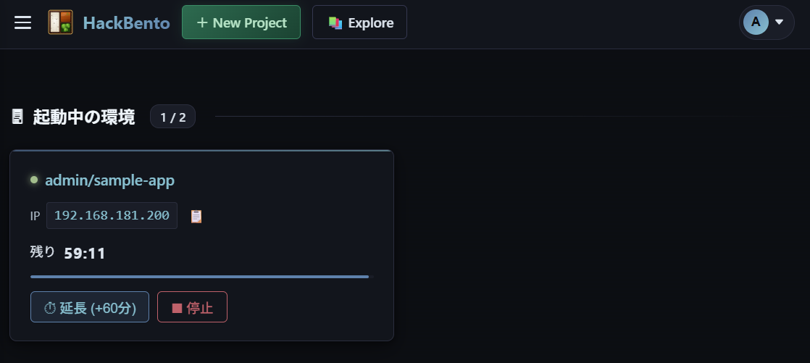

# HackBento

An on-premises environment platform for internal security training and vulnerability reproduction.  
Users can upload and register Docker images, or guest kernels/rootfs for Firecracker microVMs, then instantly launch isolated container/microVM environments — a TryHackMe-like experience that runs entirely on-premises within your internal network.

> **This project is designed to be deployed within a corporate/private network (private IP space).  
> It is not intended to be exposed directly to the internet.**

HackBento uses **direct IP assignment to containers/VMs** (via a macvlan or bridge network), eliminating the need for port mappings or Bastion hosts. Users can SSH directly into the allocated IP address of their environment.



## Features

- **One-click launch** — Select a project and press a button to spin up an environment with an IP address assigned instantly
- **Direct IP access** — Users can SSH, curl, and nmap the allocated IP directly (no Bastion or VPN required). Note: the launched environment must have SSH/curl/nmap support built in.
- **Two backends to choose from**:
  - **macvlan + Docker containers** (no KVM required; runs OCI images)
  - **bridge + Firecracker microVMs** (KVM required; kernel-level isolation; runs guest kernel/rootfs images)
  - Each host runs exactly one backend (selected interactively by `setup.sh`). IP addresses on the physical network are assigned directly to containers/VMs (no port mapping required)
- **Automatic rootfs tar→ext4 conversion** (bridge mode) — Uploading a simple `docker export`-style tar archive as a rootfs is automatically converted to an ext4 image in the background
- **Timeout management** — Environments are automatically deleted after a set period; an extend button resets the timer
- **3 authentication methods** — Local accounts / LDAP / Google OAuth2
- **Project management** — Manage and share projects via GitHub-style `owner/slug` URLs

## Use Cases

- Internal security training (CTF format)
- Storing and sharing CVE / vulnerability PoC reproduction environments
- Creating and distributing vulnerable machines with embedded flags
- Providing reproducible sandbox environments

## Architecture

```
[Internal Network]

Corporate user terminal
  │
  ├─ Browser → HackBento Web UI (lifecycle management)
  │
  └─ ssh user@192.168.180.200  ← Direct IP access (no Bastion required)
                │
                ▼
         Docker container or Firecracker microVM
         (IP assigned directly via macvlan or bridge)

[Web server role]
  HackBento ──Docker API / Firecracker REST API──► Container/VM runtime
  (management API only)                              │
                                                     ├─ env-001: 192.168.180.200
                                                     ├─ env-002: 192.168.180.201
                                                     └─ env-003: 192.168.180.202
```

## Tech Stack

| Component | Details |
|---|---|
| Backend | Python 3.12 + FastAPI |
| Frontend | Jinja2 templates + Vanilla JS |
| Database | SQLite (async via aiosqlite) |
| Authentication | JWT (Cookie + Bearer) / LDAP / Google OAuth2 |
| Environment runtime | Docker + macvlan network, or Firecracker + bridge network (KVM required) |
| Deployment | Docker Compose (`network_mode: host`) |

## Requirements

- Linux host
- Docker Engine / Docker Compose
- **macvlan mode**: NIC that supports the macvlan driver
- **bridge mode** (Firecracker microVMs, kernel-level isolation): KVM (`/dev/kvm`, SVM/VT-x enabled in BIOS), `iproute2`, systemd

Each host runs exactly one backend (chosen interactively by the setup script described below).

## Setup

### 1. Clone the repository

```bash
git clone <repository-url> hack-bento
cd hack-bento
```

### 2. Run the setup script

The interactive `setup.sh` script (requires root) automates everything from backend selection to network configuration and generation of `.env` / `docker-compose.override.yml`.

```bash
sudo ./setup.sh
```

What the script does:

- Checks for `/dev/kvm` and whether a bridge can be created, then offers a choice of available backend (`bridge`/`macvlan`)
- Detects/asks for the physical NIC, subnet, gateway, and DNS
- **macvlan mode**: Generates a `docker-compose.override.yml` defining a macvlan network named `hackbento-vm`
- **bridge mode**: Creates a Linux bridge on the host OS, attaches the physical NIC to it, and persists the configuration via `netplan`. It also sets up a cgroup v2 delegation tree (and a systemd service to recreate it on boot) used to enforce per-VM resource limits (memory, PID count, CPU usage) for Firecracker
- Generates `.env` (copied from `.env.example`) and sets `VM_BACKEND` and the relevant network variables

> To change the network configuration later, run `docker compose -f docker-compose.yml -f docker-compose.override.yml down` and re-run `sudo ./setup.sh` (it regenerates `docker-compose.override.yml`).

### 3. Review and edit .env

At minimum, check and set the following:

```bash
# Public hostname and port
DOMAIN=your-server.example.com
PORT=8000

# JWT signing key (must be changed)
SECRET_KEY=$(openssl rand -hex 32)
```

The IP pool (`IP_POOL_START`/`IP_POOL_END`) is automatically set to fall within the subnet detected by `setup.sh`, but adjust it if needed. An out-of-range IP will cause the container/VM to fail to start.

### 4. Start

```bash
docker compose -f docker-compose.yml -f docker-compose.override.yml up -d
```

### 5. Access

```
http://<DOMAIN>:<PORT>/
```

Default admin account: `admin` / `admin`

**Please change the password immediately after the first login.**  
Go to the user icon in the top right → **User Settings** to change it (local users only).

### First login for LDAP / Google OAuth2 users

When logging in via LDAP or Google OAuth2 for the first time, you will be redirected to the username setup screen (`/setup-username`).  
Set your desired username to proceed to the home screen. The username cannot be changed once set.

## Authentication Configuration

### LDAP (optional)

```bash
LDAP_ENABLED=true
LDAP_URI=ldap://ldap.example.com:389       # LDAP server URI
LDAP_TOP_DOMAIN=dc=example,dc=com          # BaseDN
LDAP_USER_FILTER=(uid={username})          # User search filter
LDAP_OU_USER=people                        # User OU
LDAP_OU_GROUP=groups                       # Group OU
```

An LDAP connectivity badge (green = reachable, red = unreachable) is displayed on the login screen.

### Google OAuth2 (optional)

1. Create an OAuth 2.0 Client ID in [Google Cloud Console](https://console.cloud.google.com/)
2. Register the following as authorized redirect URIs:
   ```
   http://<DOMAIN>/api/auth/oauth/google/callback        # Port 80
   http://<DOMAIN>:<PORT>/api/auth/oauth/google/callback  # Other ports (http)
   ```
3. Set in `.env`:

```bash
GOOGLE_OAUTH_ENABLED=true
GOOGLE_CLIENT_ID=your-client-id.apps.googleusercontent.com
GOOGLE_CLIENT_SECRET=your-client-secret
OAUTH_ALLOWED_DOMAINS=example.com  # Leave empty to allow all Google accounts
```

## Features

### Project Management

Each project holds the kind of asset matching its host's `VM_BACKEND` (only projects matching the host's backend can be listed/launched):

- **macvlan backend**: Upload Docker images (`.tar` / `.tar.gz` / `.tgz` / `.tar.zst`) or register via Docker Hub URL
- **bridge backend** (Firecracker microVMs): Provide a guest kernel and a rootfs (ext4) each via upload, URL link, or by selecting one of the shared default assets registered by an admin
  - If a simple `docker export`-style tar is uploaded as the rootfs, it is automatically converted to an ext4 image in the background (a status badge is shown during conversion, and launching is blocked until it completes)
- Access projects via `/{owner}/{slug}` URLs
- Visibility settings: `public` (everyone) / `protected` (logged-in users) / `private` (restricted)
- Collaborators: `Read` (view & launch) / `Read-Write` (view, launch & edit)

### Environment Management

- Launch an environment with one click; an IP address is allocated immediately
- Default 60-minute timeout; extendable with the "+60 min" button
- Warning displayed when 10 minutes remain
- Maximum 2 environments per user, 20 system-wide (configurable)
- Each environment is subject to memory limits, process count limits, and CPU usage limits to reduce host impact from malicious images/VMs (enforced via Docker's resource limiting for macvlan, and a host-side cgroup v2 delegation tree for bridge)

### Admin Panel (`/admin`)

- **Running environments**: List all active environments across users; force-stop any of them
- **User management**: Add local users, enable/disable, change roles, reset passwords, delete
- **Project management**: List all projects; delete
- **Default VM assets** (bridge backend): Register and manage shared guest kernels/rootfs images that bridge projects can select from when created. Rootfs tar uploads are automatically converted to ext4

## Environment Variables

| Variable | Default | Description |
|---|---|---|
| `APP_TITLE` | `HackBento` | Application name displayed in the Web UI |
| `DOMAIN` | `localhost` | Public hostname |
| `SCHEME` | `http` | `http` or `https` |
| `PORT` | `8000` | Listening port |
| `SECRET_KEY` | (required) | JWT signing key |
| `ACCESS_TOKEN_EXPIRE_MINUTES` | `480` | JWT expiry (minutes) |
| `DATABASE_URL` | SQLite | Database connection URL |
| `DEFAULT_TIMEOUT_MINUTES` | `60` | Default environment timeout (minutes) |
| `TIMEOUT_WARNING_MINUTES` | `10` | Minutes remaining before timeout warning |
| `MAX_ENVS_PER_USER` | `2` | Max simultaneous environments per user |
| `MAX_ENVS_TOTAL` | `20` | Max simultaneous environments system-wide |
| `VM_CPU_LIMIT` | `1` | CPU limit per environment (cores) |
| `VM_MEMORY_LIMIT_MB` | `1024` | Memory limit per environment (MB) |
| `VM_DISK_LIMIT_GB` | `10` | Disk limit per environment (GB) |
| `VM_PIDS_LIMIT` | `256` | Max process count per environment (fork bomb protection) |
| `UPLOAD_IMAGE_MAX_MB` | `6144` | Max upload size for Docker image files (MB) |
| `UPLOAD_README_MAX_MB` | `10` | Max upload size for README files (MB) |
| `VM_BACKEND` | `macvlan` | `macvlan` or `bridge` (set by `setup.sh`) |
| `MACVLAN_NETWORK` | `hackbento-vm` | macvlan network name |
| `BRIDGE_NAME` | `vmbr-hackbento` | bridge mode: name of the host bridge that TAP interfaces attach to (created by `setup.sh`) |
| `FC_GUEST_GATEWAY` | `192.168.180.1` | bridge mode: gateway routed to the guest (the host's bridge IP) |
| `IP_POOL_START` | `192.168.181.200` | IP pool start address (must be within subnet) |
| `IP_POOL_END` | `192.168.181.230` | IP pool end address (must be within subnet) |
| `LDAP_ENABLED` | `false` | Enable LDAP authentication |
| `LDAP_URI` | `ldap://...` | LDAP server URI |
| `LDAP_TOP_DOMAIN` | `dc=example,dc=com` | BaseDN |
| `LDAP_USER_FILTER` | `(uid={username})` | User search filter |
| `LDAP_OU_USER` | `people` | User OU |
| `LDAP_OU_GROUP` | `groups` | Group OU |
| `GOOGLE_OAUTH_ENABLED` | `false` | Enable Google OAuth2 |
| `GOOGLE_CLIENT_ID` | (empty) | Google OAuth2 Client ID |
| `GOOGLE_CLIENT_SECRET` | (empty) | Google OAuth2 Client Secret |
| `OAUTH_ALLOWED_DOMAINS` | (empty = all) | Allowed email domains (comma-separated) |

See `.env.example` for full details.

## HTTPS

When `SCHEME=https` is set, uvicorn terminates TLS directly (no reverse proxy such as nginx is required).

```bash
# .env
SCHEME=https
PORT=443
DOMAIN=your-server.example.com
```

If `/data/certs/server.crt` and `/data/certs/server.key` do not exist at startup, a self-signed certificate is generated automatically.  
To use a proper certificate, place it at those paths.

If using Google OAuth2, also update the redirect URI in Google Cloud Console to `https://...`.

## Out of Scope (and Why)

- SSH proxying / Web terminal — users SSH directly to the IP
- Public key injection — in CTF scenarios, credentials are part of the challenge
- VPN management — the system is self-contained within the internal network
- Flag submission / scoring — out of scope

## Intended Deployment Environment

This project is designed for deployment in:

- **Corporate networks / private IP space** (RFC 1918: 10.x.x.x / 172.16–31.x.x / 192.168.x.x)
- **Closed networks isolated from the internet**

Because HackBento intentionally handles vulnerable Docker images, exposing it to a public network risks unauthorized access by third parties.

## Contributing

If you find a bug or issue, please report it via [Issues](../../issues).

## Disclaimer

The authors and contributors are not liable for any damages arising from the use or inability to use this software, including but not limited to data loss, system failures, or security incidents.

Use this software at your own risk, in an appropriate environment with proper authorization.

## License

[GNU General Public License v3.0](LICENSE)

Copyright (C) 2026 ka1222te

This program is free software: you can redistribute it and/or modify it under the terms of the GNU General Public License as published by the Free Software Foundation, either version 3 of the License, or (at your option) any later version.

This program is distributed in the hope that it will be useful, but WITHOUT ANY WARRANTY; without even the implied warranty of MERCHANTABILITY or FITNESS FOR A PARTICULAR PURPOSE. See the GNU General Public License for more details.
